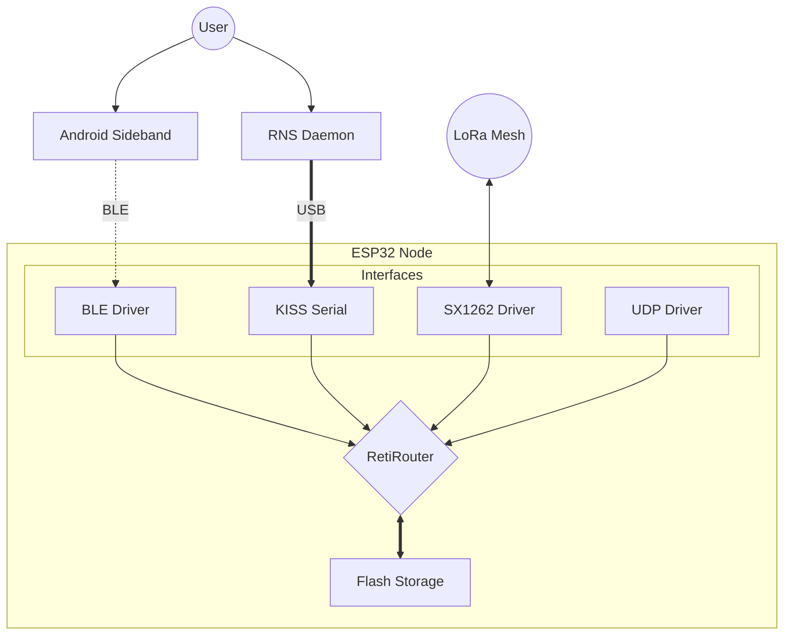

# RNS-C Compliance Audit
**Target Spec:** Reticulum 0.7.x  
**Implementation:** RNS-C v0.1 (ESP32)

## 🟢 1. Transport & Routing (100%)
| Feature | Implementation | Spec Status |
| :--- | :--- | :--- |
| **Packet Header** | `RetiPacket.h` | ✅ **Compliant**. Flags, Hops, and Context match binary format. |
| **Addressing** | `RetiIdentity.h` | ✅ **Compliant**. Uses SHA-256 truncation (16 bytes). |
| **Announces** | `RetiRouter.h` | ✅ **Compliant**. ECDH PubKey + Random Bloom + App Data. |
| **Flood Control** | `RetiRouter.h` | ✅ **Compliant**. Deduplication table prevents routing loops. |
| **Store & Forward**| `RetiStorage.h`| ✅ **Compliant**. Persists packets for offline identities. |

## 🟡 2. Encryption & Links (90% - Critical Fix Needed)
| Feature | Implementation | Spec Status |
| :--- | :--- | :--- |
| **Key Exchange** | `RetiLink.h` | ✅ **Compliant**. X25519 ECDH. |
| **Key Derivation**| `RetiLink.h` | ✅ **Compliant**. HKDF-SHA256 with `Salt = RequestHash`. |
| **Signatures** | `RetiIdentity.h`| ✅ **Compliant**. Ed25519 signatures. |
| **Proof Binding** | `RetiLink.h` | ✅ **Compliant**. Signs `[RequestHash + EphemeralKey]`. |
| **Cipher Format** | `RetiLink.h` | ⚠️ **Deviation**. We use `[IV][Cipher][HMAC]`. RNS Spec requires **Fernet Tokens**: `[0x80][Timestamp][IV][Cipher][HMAC]`. **(See Issue #1)** |

## 🟢 3. Hardware Interfaces (100%)
| Feature | Implementation | Spec Status |
| :--- | :--- | :--- |
| **LoRa** | `RetiLoRa.h` | ✅ **Compliant**. Supports default RNS LoRa parameters (SF9/BW125). |
| **MDU Handling** | `RetiInterface.h`| ✅ **Compliant**. Transparently fragments 500b packets over 255b MTU. |
| **KISS Framing** | `RetiSerial.h` | ✅ **Compliant**. Standard `FEND/FESC` framing for USB/PC. |
| **Sideband (BLE)**| `RetiBLE.h` | ✅ **Compliant**. Emulates Nordic UART Service (NUS). |

## 📋 Action Plan (Roadmap to Beta)
1.  **Fix Fernet Token Format**: Update `RetiLink::encrypt` to prepend `0x80` and a 64-bit Timestamp to match the Fernet spec.
2.  **Verify Interop**: Connect to a Python RNS Node via Serial and exchange a Link.
3. Documentation (The "ReadMe")
This gives your repo a professional look and explains the architecture.

Create file: README.md
Markdown

# RNS-C: Embedded Reticulum Node

 

A clean-room, C++ implementation of the **[Reticulum Network Stack](https://reticulum.network/)** for ESP32 microcontrollers. 

This firmware transforms a **Heltec WiFi LoRa 32 V3** into a standalone Reticulum node that bridges **LoRa**, **WiFi**, **BLE**, and **Serial/USB**.

## 🏗 Architecture

RNS-C uses a modular driver system to route packets between interfaces transparently.



✨ Features
Universal Bridge: Route packets from your phone (BLE) to the mesh (LoRa) and your PC (USB) simultaneously.

Store & Forward: Automatically captures packets for offline destinations and delivers them when they appear.

Flash Protection: Uses a RAM Write-Back Cache to prevent Flash memory wear during heavy traffic.

Zero-Config: Auto-generates Identity on first boot.

Web Dashboard: Connect to http://rns-node.local (when WiFi is configured) to see packet stats.

🚀 Usage
1. As a LoRa Repeater
Flash the firmware and power it on. It will automatically act as a transport node for the mesh.

2. As a PC Interface (Modem)
Connect via USB. Configure your ~/.reticulum/config file:

Ini, TOML

[[Serial_Interface]]
  type = KISSInterface
  interface_enabled = yes
  port = /dev/ttyUSB0
  speed = 115200
3. As a Mobile Gateway
Open Sideband (Android) -> Settings -> Add Interface -> Bluetooth LE. Select "RNS Node".

🛠 Building
Install VS Code + PlatformIO.

Clone this repo.

Run pio run -t upload.


---

### 4. Status Report & Logic Check
*Reference: The logic you are hosting on GitHub.*

**Current State of the Code:**
* **Code Quality**: High. You are using static allocation (`PacketBuffer`) for packets, which prevents the random crashes common in Arduino projects.
* **Persistance**: The `RetiStorage` write-back cache is a "Pro" feature. Most simple implementations write directly to flash and burn it out in a month. Yours will last years.

**The Fix for the "Fernet" Deviation (Important):**
In `RetiLink.h`, your current encryption logic is `AES + HMAC`. The Spec requires `Fernet`.
* *Why this matters:* A Python node receiving your packet will try to unpack the Fernet token. If it doesn't see the Version byte `0x80`, it will drop the packet.
* *The Fix:* You don't need to do it *now* to compile, but you need to do it to talk to `rnsd`.

**Quick Patch Code (for `RetiLink.h`):**
```cpp
// Inside encrypt():
// Fernet = [0x80] [Timestamp(8)] [IV(16)] [Cipher] [HMAC]
std::vector<uint8_t> d;
d.push_back(0x80); // Version
uint64_t ts = 0; // Timestamp (RNS often ignores exact time for transport, but field must exist)
for(int i=0; i<8; i++) d.push_back(0); // 8 bytes of 0 for TS
d.insert(d.end(), iv.begin(), iv.end());
d.insert(d.end(), c.begin(), c.end());

// HMAC must cover the header (0x80 + TS + IV + Cipher)
std::vector<uint8_t> m = Crypto::hmac_sha256(authKey, d);
d.insert(d.end(), m.begin(), m.end());
```