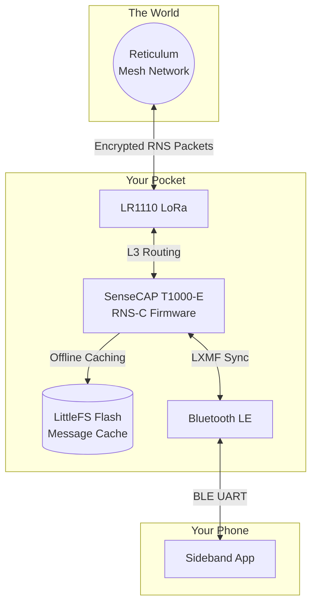

<div align="center">

# RNS-C 🛰️
**Standalone Reticulum & Micro-LXMF Node for SenseCAP T1000-E**

[](https://opensource.org/licenses/MIT)
[]()
[]()


*Bring the decentralized Reticulum Network Stack anywhere in your pocket.*

</div>

---

## 📖 Overview

**RNS-C** is a highly optimized, bare-metal C++ implementation of the [Reticulum Network Stack](https://reticulum.network/) (RNS) and the LXMF messaging protocol, designed specifically to run autonomously on the **Seeed Studio SenseCAP T1000-E** (nRF52840 / LR1110) card tracker.

By flashing this firmware, you convert the tracker into a powerful, battery-powered **Standalone Mesh Router & LXMF Propagation Node**. It bridges Sub-GHz LoRa traffic directly to your phone via Bluetooth Low Energy (BLE), while transparently caching offline messages for you in its internal flash memory.

---

## ✨ Features

- **🔋 Ultra-Low Power C++ Core**: Ditches the Python daemon overhead for a purely embedded C++ routing layer (`mbedtls`, `monocypher`).
- **📡 Sub-GHz & BLE Bridging**: Automatically routes packets between the LR1110 LoRa radio and the nRF52 BLE interface.
- **📩 Micro-LXMF Inbox**: Operates as a true LXMF Propagation Node. It intercepts messages bound for you while your phone is offline, caches them to `LittleFS`, and seamlessly streams them back when you connect via the Sideband app.
- **🔐 End-to-End Encrypted**: Full support for Reticulum's X25519 Ephemeral Key Exchange, Ed25519 Signatures, and AES-128-CBC Fernet links.
- **🗺️ Zero-Conf Routing**: No IP addresses, no servers, no configuration. Just turn it on.

---

## 🏗️ Architecture


```mermaid
graph TD
    subgraph "Your Pocket"
        T[SenseCAP T1000-E<br>RNS-C Firmware]
        FS[(LittleFS Flash<br>Message Cache)]
        BLE[Bluetooth LE]
        LORA[LR1110 LoRa]
    end

    subgraph "Your Phone"
        SB[Sideband App]
    end

    subgraph "The World"
        MESH((Reticulum<br>Mesh Network))
    end

    MESH <-->|Encrypted RNS Packets| LORA
    LORA <-->|L3 Routing| T
    T -->|Offline Caching| FS
    T <-->|LXMF Sync| BLE
    BLE <-->|BLE UART| SB
```

---

## 🚀 Installation & Flashing

Because the T1000-E uses the nRF52840, flashing is incredibly simple and requires no command-line tools if you use the UF2 Bootloader.

### Method 1: Web Drag-and-Drop (UF2) - Recommended
1. Download the latest `firmware.uf2` from the Releases page.
2. Connect the SenseCAP T1000-E to your PC via the magnetic USB cable.
3. **Double-tap the power/reset button** rapidly. The tracker's LED will pulse, and a new USB flash drive named `T1000EBOOT` will appear on your computer.
4. Drag and drop the `firmware.uf2` file onto the `T1000EBOOT` drive.
5. The drive will automatically unmount, and the tracker will reboot into RNS-C!

### Method 2: PlatformIO (For Developers)
If you want to modify the source code (e.g., adding custom LXMF routing logic), you can build it yourself using PlatformIO.

```bash
# Clone the repository
git clone https://github.com/your-username/reticulum-transport-node.git
cd reticulum-transport-node

# Build and upload for the SenseCAP T1000-E environment
pio run -e sensecap_t1000 -t upload
```

---

## 🛠️ Usage

1. **Power On**: Hold the button on the SenseCAP to turn it on. It will immediately begin listening on LoRa.
2. **Pair Phone**: Open the **Sideband** app on your Android/iOS device. Go to Interfaces and add a new "Bluetooth Serial" interface. Select the `SenseCAP RNode` device.
3. **Sync**: Once connected, Sideband will automatically detect the tracker's internal LXMF Propagation Node. Any messages it cached while you were disconnected will instantly pour into your inbox.

---

## 📂 Repository Structure

- `/src`: Main application entry point (`main.cpp`), initializing the hardware and bringing up the router.
- `/lib/Reticulum/src`: The core C++ implementation.
  - `RetiRouter.h`: Layer 3 routing engine and flood control.
  - `RetiLXMF.h`: Application layer propagation and LittleFS file caching.
  - `RetiLink.h`: Symmetric tunnel establishment and X25519 key exchanges.
  - `RetiCrypto.h`: Cryptographic wrappers for `mbedtls`.
- `/include`: Board definitions and pin mapping (`BoardConfig.h`).

---

## ⚖️ Compliance & Security
This firmware implements the Reticulum Network Stack protocol. It uses standard cryptographic primitives (`mbedtls`, `monocypher`) to ensure protocol compliance with standard Python nodes.

*Note: The LR1110 radio currently communicates with modern SX126x/SX1280 nodes. It does not support direct legacy SX127x reception.*

**License**: MIT